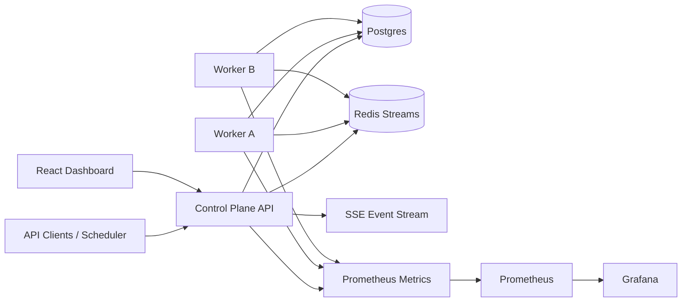
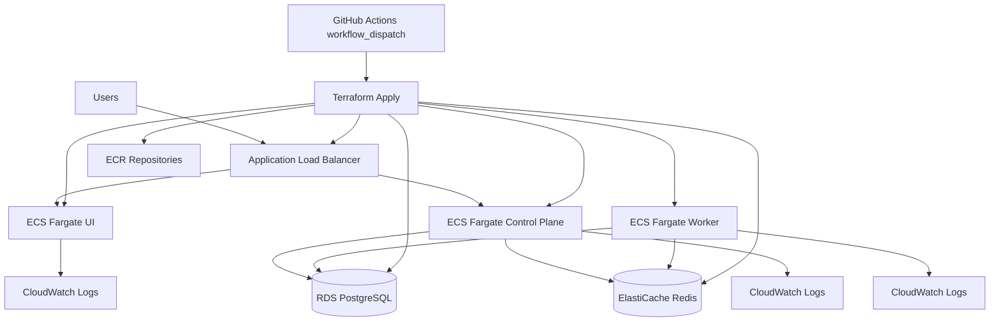

# Workflow Orchestrator

Distributed workflow orchestration platform built as a portfolio project to show end-to-end execution control: DAG validation, durable run/task state, Redis Streams dispatch, worker leases, retries/dead-letter, scheduler triggers, RBAC/rate limits, live dashboard, and production-style observability.

## Live Cloud Deployment

- Live URL: `http://workflow-orc-demo-alb-1577468805.us-east-1.elb.amazonaws.com`
- Health: `http://workflow-orc-demo-alb-1577468805.us-east-1.elb.amazonaws.com/api/health`
- Infra: ECS Fargate (API/worker/UI), ALB, RDS Postgres, ElastiCache Redis, ECR, Terraform

## 90-Second Reviewer TL;DR

```bash
npm install
npm run lint
npm run test
npm run bench
```

## Problem

Teams often glue together cron jobs, ad hoc queues, and scripts without a single control plane for execution safety. This project focuses on the operational gap:

- Trigger workflows safely and idempotently.
- Execute distributed tasks with crash recovery.
- Surface failures quickly with metrics/events.
- Provide a usable UI for run/task investigation.

## Demo

- Demo GIF: `docs/assets/demo.gif`


## Architecture



### Reliability Model

- Delivery semantics: at-least-once execution.
- Lease model: workers claim tasks with `lease_expires_at` and heartbeat renewal.
- Recovery: lease reaper re-queues expired tasks or routes terminal failures to dead-letter.
- Retry policy: exponential backoff with bounded attempts.
- Trigger dedupe: `(workflow_id, idempotency_key)` uniqueness prevents duplicate runs.

## Stack

- Runtime: Node.js + TypeScript monorepo (npm workspaces)
- Control plane: Express + Postgres + Redis Streams + node-cron
- Worker: Redis Streams consumer groups + Postgres lease state
- UI: React + Vite
- Observability: Prometheus metrics + Grafana + Loki
- Infra: Docker Compose (local) + Kubernetes manifests (reference deploy)
- Tests: Vitest (unit + integration)

## Portfolio Highlights

- Distributed execution + retries/dead-letter
- Scheduling + idempotent triggers
- Observability + incident drill/postmortem

## Screenshots


## Benchmark Results

Latest benchmark artifact: `bench/results/latest.md`

| Metric | Value |
| --- | --- |
| Timestamp | 2026-02-12T01:12:23.648Z |
| Runs | 25 |
| Duration (s) | 15.94 |
| Throughput (runs/s) | 1.57 |
| Succeeded | 25 |
| Failed | 0 |

Regenerate with a live stack:

```bash
npm run bench
```

## Quickstart

### 1) Install dependencies

```bash
npm install
```

### 2) Configure environment

```bash
cp .env.example .env
```

PowerShell equivalent:

```powershell
Copy-Item .env.example .env
```

### 3) Start infra dependencies

```bash
npm run dev-up
```

### 4) (Optional) run app containers with AWS-parity images

```bash
npm run dev-up:full
```

### 5) Apply migrations

```bash
npm run -w control-plane migrate
```

### 6) Run services (separate terminals)

```bash
npm run -w control-plane dev
npm run -w worker dev
npm run -w ui dev
```

### 7) Open the dashboard

- UI: `http://localhost:5173`
- API health: `http://localhost:8080/api/health`
- Metrics: `http://localhost:8080/api/metrics`

Default tokens:

- `admin-token`
- `operator-token`
- `viewer-token`

## Cloud Deployment

### AWS Architecture



### Deploy / Teardown

Terraform uses S3 backend state with DynamoDB locking (bootstrapped in script).

```bash
export DB_PASSWORD='replace-with-strong-password'

# Plan + apply
./scripts/deploy.sh

# Plan only
APPLY=false ./scripts/deploy.sh

# Cloud smoke (ALB + /api/health)
./scripts/cloud-smoke.sh

# Teardown infra
./scripts/teardown.sh
```

GitHub Actions manual deploy:
- `.github/workflows/terraform-deploy.yml`
- Unified multi-project teardown script: `~/projects/scripts/teardown-all.sh`

Estimated running cost (continuous): about `$55-$120/month`.

### Deployment Evidence

- Dry-run plan executed on `2026-02-18` via `scripts/deploy.sh` (`APPLY=false`).
- Result: `Plan: 40 to add, 0 to change, 0 to destroy`.
- State backend bootstrap confirmed:
  - S3 state bucket created
  - DynamoDB lock table created
- Live apply executed on `2026-02-18` via `scripts/deploy.sh` (`APPLY=true`).
- ALB URL: `http://workflow-orc-demo-alb-1577468805.us-east-1.elb.amazonaws.com`
- Health verification:
  - `GET /api/health` -> `200`
  - `GET /` -> `200`
- Functional verification (`2026-02-19`):
  - `GET /api/workflows` with `Authorization: Bearer admin-token` -> `200`
  - Create smoke workflow via `POST /api/workflows` with admin token -> `201` (or `409` if already exists)
  - Trigger probe runs when workflow create returns a new ID
- Repeatable verification script: `scripts/cloud-smoke.sh`.

### Live UI Notes

- The live UI is token-gated and defaults to `admin-token`.
- If no workflows exist, the dashboard appears empty by design until one is created.
- Use `npm run demo:live-seed` (or the UI seed action) to create and trigger a deterministic demo workflow.
- No third-party API keys are required for demo usage.

## Quality Gates

```bash
npm run lint
npm run test
npm run build
```

## Key Endpoints

- `POST /api/workflows`
- `GET /api/workflows`
- `POST /api/workflows/:workflowId/trigger`
- `GET /api/runs`
- `GET /api/runs/:runId/tasks`
- `POST /api/runs/:runId/cancel`
- `GET /api/events` (SSE)
- `GET /api/metrics`

## Additional Docs

- Architecture notes: `docs/architecture.md`
- Queue/recovery ADR: `docs/adr-001-queue-and-recovery.md`
- Operations runbook: `docs/runbook.md`
- Incident drill postmortem: `docs/postmortems/2026-02-12-worker-crash-drill.md`
